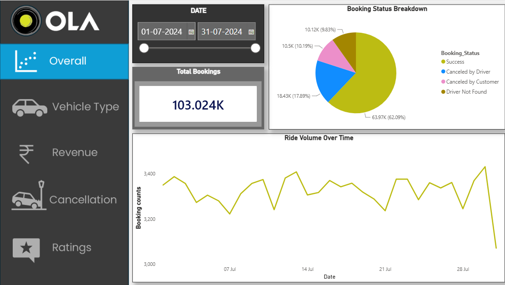

# 🚗 Ola Ride-Booking Data Analytics & Visualization

An end-to-end data analytics project using MySQL and Power BI to analyze 103,000+ ride bookings, driver/customer cancellation drivers, revenue trends, and rating distributions.

---

## 📌 Project Architecture
1. **Database Querying (MySQL):** Cleaned, filtered, and aggregated booking data using advanced SQL queries and views.
2. **Data Visualization (Power BI):** Developed an interactive 5-page report with key DAX metrics and dynamic filters.

---

## 📊 Power BI Dashboard Highlights
- **Overall Operational Overview:** Total booking volume, status distributions, and time-series demand patterns.
- **Vehicle Type Breakdown:** Performance and demand breakdown across various cab types.
- **Revenue & Payment Analysis:** Revenue generation trends and payment breakdown (UPI vs. cash/other).
- **Cancellation Insights:** Granular tracking of driver cancellations vs. customer cancellations.
- **Ratings & Feedback:** Analysis of customer and driver satisfaction metrics.

---

## 🛠️ Tools & Technologies Used
- **Database:** MySQL Workbench (SQL Queries, Views, Filters)
- **BI Tool:** Power BI Desktop (DAX, Data Modeling, Interactivity)
- **Data Format:** CSV / SQL Schemas

---

## 📈 Dashboard Preview

---

## 🔍 Key Business SQL Queries Executed
- Top 5 customer identification based on booking volume.
- Incomplete ride classification (Vehicle breakdown vs. Driver issues).
- Average driver rating per vehicle category.
- Payment breakdown focusing on UPI transactions.
